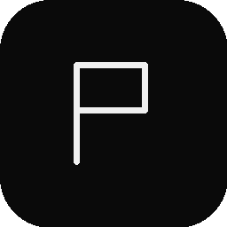

  

<h1 align="center">Pane</h1>

  A native macOS and iOS app for managing remote development environments over SSH. 
  Connect to your servers, organize projects into workspaces, and get a full terminal — powered by <a href="https://ghostty.org">Ghostty</a> and tmux.

  <a href="https://github.com/bryantebeek/pane-releases/releases/latest"><strong>Download for macOS</strong></a>

---

## What is Pane?

Pane gives you a single app to manage all your remote dev environments. SSH into servers, browse projects, split terminals, run services, view diffs, browse files — from your Mac or your iPhone. Everything syncs through tmux sessions on the server, so you can start work on your Mac and pick it up on your phone.

## Features

### Terminal
- **Ghostty-powered rendering** — GPU-accelerated terminal with Metal, full xterm-256color support
- **Split panes** — recursive binary splits (horizontal/vertical) with draggable dividers and keyboard navigation
- **tmux-backed sessions** — every tab is a tmux session on the server, persistent across app restarts and device switches
- **Multiple tabs per pane** — terminal, agent, browser, file viewer, scratchpad, git diff, and service tabs all live in the same tab bar

### Projects & Workspaces
- **Project discovery** — add directories on any server as projects, optionally configure with `pane.json`
- **Workspace branching** — each project has a `main` workspace; create additional workspaces backed by git worktrees
- **Cross-device sync** — project structure, tabs, and splits are stored in `~/.pane/server.json` on the server, so every connected device sees the same layout

### Services
- **Declare in `pane.json`** — define dev servers, workers, log tailers as named services with a command, working directory, and optional health-check URL
- **Start/stop from the sidebar** — one-click or start-all/stop-all, with live status indicators (stopped/starting/running)
- **Health checks** — HTTP probe or TCP port check runs on the server, not your laptop
- **Browser tabs** — click a service URL to open it in an in-app browser routed through a SOCKS proxy on the server, so `localhost:3000` on a remote host just works

### AI Agent Integration
- **Agent tabs** — one-click tab that launches Claude Code (or any CLI agent) in a dedicated tmux session
- **Attention indicators** — when an agent emits OSC-9 (waiting for input), an orange pulse appears in the sidebar, visible across all connected devices
- **Status tracking** — per-tab status (idle/working/waiting/done) computed from the terminal byte stream
- **Auto-rename** — new agent tabs are automatically titled by Haiku based on the conversation content

### Built-in Browser
- **Remote browsing** — all traffic routes through a SOCKS5 proxy on the server, so internal hostnames and `localhost` ports resolve correctly
- **Per-server isolation** — cookies and storage are sandboxed per server
- **Localhost rewriting** — transparent 3-layer rewrite so `http://localhost:3000` works even though the OS bypasses SOCKS for loopback

### File Browser & Git
- **Remote file tree** — browse workspace files with syntax-highlighted viewer
- **Git diff panel** — view changed files and unified diffs per workspace
- **File palette** — fuzzy file finder

### iOS
- **Full terminal on iPhone** — same Ghostty engine, same tmux sessions
- **Speech input** — dictate commands with the microphone button
- **Seamless handoff** — everything is tmux, so switching devices picks up exactly where you left off

## Requirements

- macOS 15 or later (macOS app)
- iOS 18 or later (iPhone app)
- `tmux` installed (locally on your Mac, or on a remote SSH server)

## Install

Download the latest release from the [Releases page](https://github.com/bryantebeek/pane-releases/releases/latest), unzip, and drag to `/Applications`. Pane updates automatically via Sparkle.

## How it works

Pane deploys a small Rust daemon (`pane-proxy`) to each server on first connect. The daemon handles registry sync, port forwarding, service management, file operations, git queries, and the SOCKS proxy — all over a single non-PTY SSH channel using JSON-RPC. Terminal tabs use separate PTY channels through tmux. The daemon is fully managed by the app: deployed, versioned, and updated automatically.

## Links

- **Landing page**: https://bryantebeek.github.io/pane-releases/
- **Appcast (Sparkle)**: https://bryantebeek.github.io/pane-releases/appcast.xml
